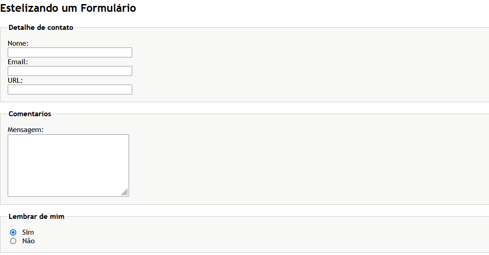

<h2 align="center">
Estelizando Formulário
</h2>

Estelizando um formulário simples, onde veremos fieldset, legend, label, input do tipo texto, radio,
textarea nesse primeiro commit

<h1 align="center">

<h2 align="center">
Estelizando um acesso de Login
</h2>

Aqui iremos usar as mesmas ferramentas do input do commit anterior, porém usando algumas imagens
para o design ficar mais interessante, tanto como imagens externas como internas no seu input,
também alinhando os elementos ao centro.

<h1 align="center">

